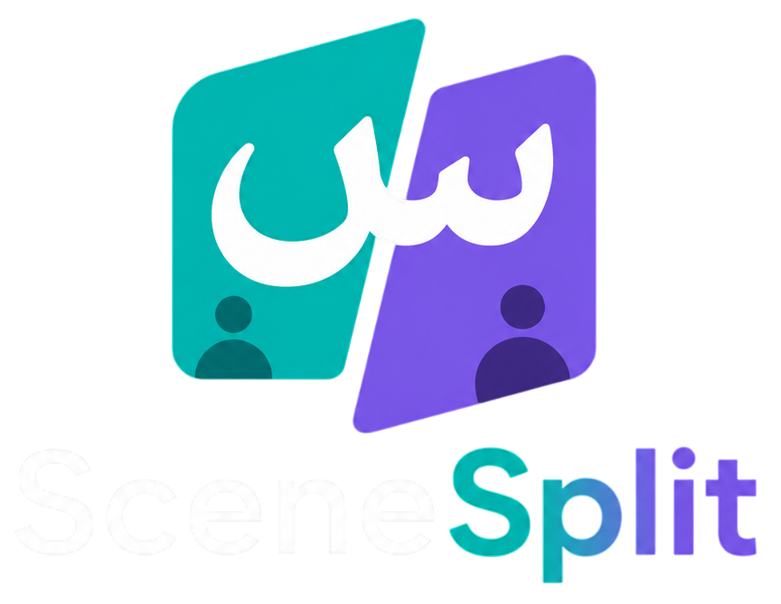
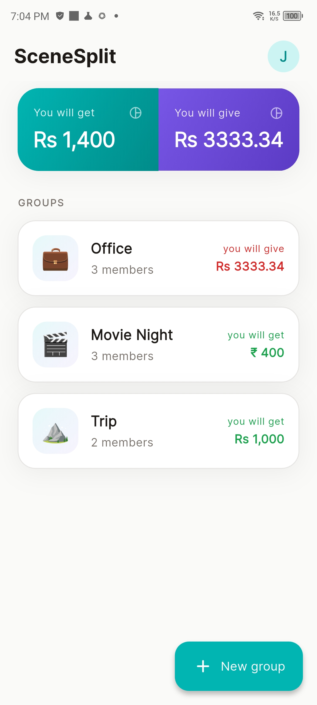
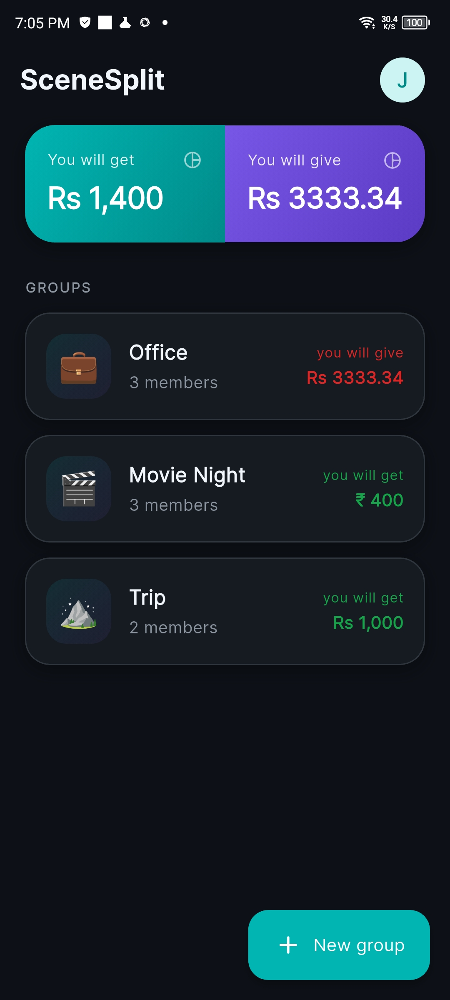
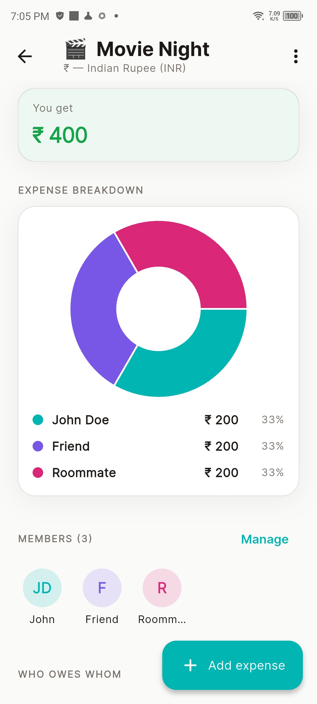
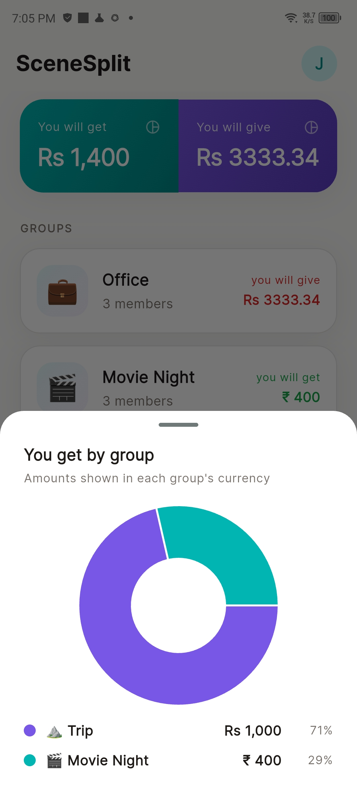

# SceneSplit

<p style="text-align: center;">
  
</p>

**Split group expenses, track who owes what, and settle up — fully offline.**

SceneSplit is a Flutter expense-splitting app for trips, roommates, dinners, and events. No account, no cloud — everything stays on your device.

## Screenshots

| Home (light) | Home (dark) |
|:---:|:---:|
|  |  |
| **Group detail** | **Pending summary** |
|  |  |

## Features

- **People & groups** — Manage a global people pool from Profile; create groups with emoji icons and members
- **Flexible splits** — Equal, exact amounts, or percentage, with live validation; choose who is included per expense
- **Balances & settlements** — Live balances across groups, smart settlement suggestions, and editable settlement records
- **Insights** — Group expense total and member-share pie chart on group detail
- **Currency** — App-wide default for home summary and new groups; each group has its own currency
- **Appearance** — System, light, or dark theme (saved and applied before first frame)
- **Backup** — Export and import a local database backup (non-web platforms)
- **Legal & about** — In-app privacy policy, terms of service, and app version
- **Offline-first** — All data stored locally with Drift (SQLite); no sign-in required

## Tech Stack

| Layer | Technology |
|-------|------------|
| Framework | Flutter 3.44 / Dart 3.12 |
| State management | Riverpod 3 |
| Database | Drift 2.34 (SQLite) |
| Architecture | Feature-first + service / repository |
| Charts | fl_chart |
| Navigation | Material navigation (`go_router` listed for future use) |

## Prerequisites

- Flutter SDK (3.44.5 stable or compatible)
- Dart SDK `^3.12.2`

## Getting Started

```bash
flutter pub get
dart run build_runner build --delete-conflicting-outputs   # only after schema changes
flutter run
```

## Project Structure

```
lib/
├── main.dart / app.dart
├── core/
│   ├── constants/     # currencies, group emojis, assets
│   ├── theme/
│   └── utils/         # money formatting
├── database/
│   ├── tables.dart
│   ├── app_database.dart
│   └── app_database.g.dart
├── repositories/      # user, group, expense, settlement
├── services/          # split engine, balance
├── providers/         # Riverpod streams and derived state
├── features/
│   ├── onboarding/
│   ├── home/
│   ├── groups/        # create, edit, detail
│   ├── expenses/
│   ├── settlements/
│   ├── profile/       # appearance, currency, people, data & backup
│   ├── legal/
│   └── about/
└── shared/widgets/
```

## Database Schema

All money amounts are stored as **integer cents**.

| Table | Purpose |
|-------|---------|
| `Users` | Global people pool (`id`, `name`, `colorIndex`, `isCurrentUser`) |
| `AppSettings` | Single row: default `currencyCode`, `themeMode` |
| `Groups` | Group name, emoji, `currencyCode` |
| `GroupMembers` | Group ↔ user membership |
| `Expenses` | Group expenses (`amountCents`, `paidById`, `splitType`, note, date) |
| `ExpenseSplits` | Per-user split amounts |
| `Settlements` | Recorded payments between members |

## Commands

```bash
flutter pub get
flutter analyze
flutter test
dart run build_runner build --delete-conflicting-outputs
flutter run
```

See [`AGENTS.md`](AGENTS.md) for dependency pins, architecture conventions, and codegen notes.

## Future Enhancements

- Backend sync
- Multi-currency with exchange rates
- Receipt scanning
- Export (PDF / CSV)
- Localization

## Contributing

CI, PR checks, releasing, and GitHub secrets are documented in [`CONTRIBUTING.md`](CONTRIBUTING.md).

## License

[MIT](LICENSE)
